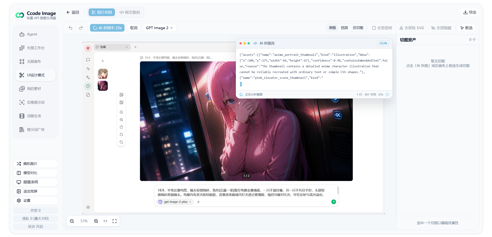
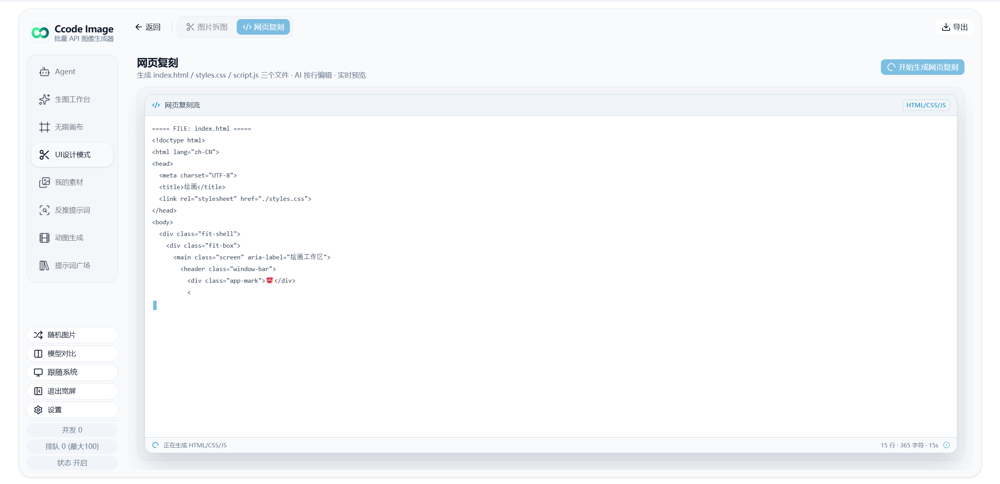
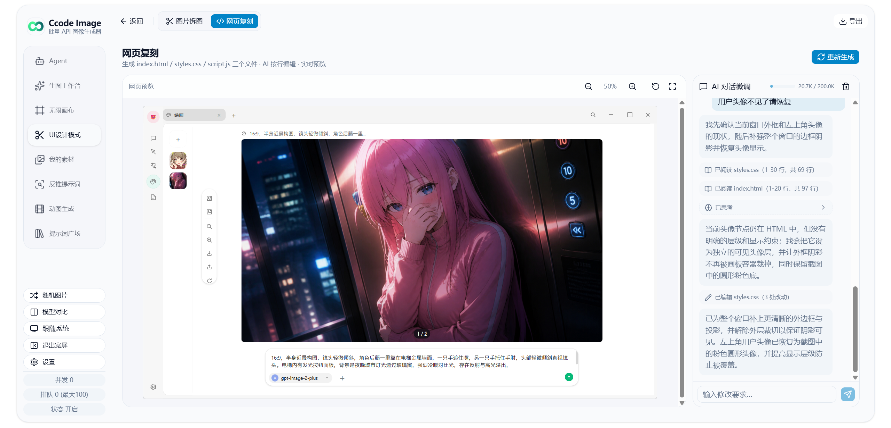
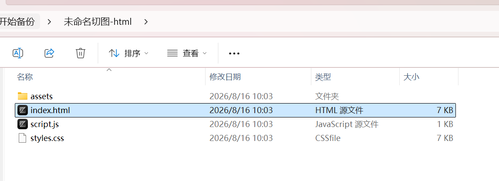

# Nova Image Studio

<div align="center">

**自托管的 AI 图像生成工作台 · 自定义模型 · 多模式 · PWA · 实时任务**

**dev 增强：Nacos 远程模型配置 · ZIP64 流式大备份 · Docker 开发预览 · 局域网 HTTPS**

[](https://github.com/wsbjj/nova-image-studio/tree/dev)
[](https://github.com/wsbjj/nova-image-studio/tree/dev)
[](LICENSE)
[](https://nodejs.org)
[](https://nextjs.org)
[](https://react.dev)

</div>

---

## 📖 简介

Nova Image Studio（简称 Nova Image）是一个面向个人/团队的 AI 图像生成工作台。前端使用 Next.js 16 + React 19 静态导出（PWA），后端是轻量 Node.js 服务（`server.js` + SQLite + WebSocket），统一调度任务并代理图像生成 API。

本仓库的默认分支 `dev` 基于 [tianjiangqiji/nova-image-studio](https://github.com/tianjiangqiji/nova-image-studio) `v3.2.0` 持续增强，在保留原有生成工作台、Agent、无限画布和提示词广场的基础上，重点补齐团队模型配置、大数据备份、本机开发与局域网部署链路。

**开源版特性：**
- 支持分别配置图片模型与文本模型，模型级独立保存 API Key 与 Base URL
- 用户自定义模型列表和 API 端点，后端按协议路由并透传已配置参数
- 所有配置存储在浏览器 localStorage
- 文字模型支持 Google（generateContent）和 OpenAI（Response 协议）

> 当前版本：**v3.2.0**

## 🧭 dev 分支改动与优化

以下内容为 `dev` 相对本仓库 `main` 的已实现增强，当前 GitHub 默认分支也是 `dev`。

| 方向 | 实现改动 | 优化效果 |
| --- | --- | --- |
| Nacos 远程模型配置 | 设置页新增“远程下发”，通过后端代理读取 Nacos 3.x 模型配置，支持 Namespace、Group、Data ID 与可选账号密码 | 团队可集中维护图片模型、文本模型和默认模型；浏览器无需直接跨域访问 Nacos，拉取后仍落到本地配置 |
| 大体积完整备份 | 新增流式 ZIP/ZIP64 写入器和按中央目录读取的归档解析器，兼容旧版 JSZip 备份及历史 4GB 偏移回绕归档 | 不再对整个备份执行 `file.arrayBuffer()` 或一次性解压，降低内存峰值，支持超过 4GB 的完整备份导入导出 |
| 备份交互性能 | IndexedDB / localforage 按库、Store、记录分批处理，二进制按条目写入，并定期让出主线程和更新进度 | 大量历史图片和画布素材备份时页面更少卡顿，进度更清晰，失败定位更准确 |
| Docker 开发预览 | 新增 `Dockerfile.dev` 与 `docker-compose.dev.yml`，源码 bind mount、依赖独立 volume，并修复 Next.js dev handler 对原始 URL 的处理 | 一条命令启动前端 HMR、后端 API 与 WebSocket，避免宿主机 Node 原生依赖差异 |
| 当前源码部署与 LAN HTTPS | 新增 `docker-compose.prod.yml`、`deploy.env` 和 Caddy 内部 CA 反向代理，补充默认 SNI | 可直接构建当前 `dev` 源码部署，并在局域网通过 HTTPS 使用 PWA、剪贴板等安全上下文能力 |

> “远程下发”当前是客户端从 Nacos **拉取**模型注册表并保存到浏览器，不会把本地配置反向发布到 Nacos，也不会同步任务历史、图片或画布数据。

## 💎 赞助商

期待您的赞助

---

## 🖼️ UI 预览

### 生图工作台

| 宽屏 | 窄屏 | 手机版 |
|:---:|:---:|:---:|
|  |  |  |

### UI设计模式（图片切图 + 网页复刻）

从一张 UI 原图出发：AI 自动拆图 → 切图编辑器手动调整 → agent 多轮对话复刻网页 → 导出完整设计包。

| ① 待复刻原图 | ② 导入并开始拆图 | ③ 自动拆图 + 手动调整 | ④ 开始生成网页复刻 |
|:---:|:---:|:---:|:---:|
|  |  |  |  |

| ⑤ Agent 修改复刻 | ⑥ 多轮完成修改 | ⑦ 导出为压缩包 | ⑧ 实物展示 |
|:---:|:---:|:---:|:---:|
|  |  |  |  |

### Agent 模式

| 询问 | 生成 |
|:---:|:---:|
|  |  |

### GIF 生成

| 生成 | 微调 |
|:---:|:---:|
|  |  |

### 无限画布

| 预览 | 编辑 |
|:---:|:---:|
|  |  |

### 其他功能

| 反推提示词 | 提示词广场 | 我的素材 | 设置 |
|:---:|:---:|:---:|:---:|
|  |  |  |  |

---

## ✨ 功能特性

### 六大工作模式

| 模式 | 入口 | 简介 |
| --- | --- | --- |
| 🎨 文本生图 | `TextToImageForm` | 纯文字提示词生成图像，支持多图并行 |
| 🖼️ 图生图 | `ImageToImageForm` | 上传参考图，编辑/转换/风格化 |
| 🤖 Agent 智能体 | `AgentChatWorkspace` | 多轮对话式生成：聊天 → 方案 → 出图，支持 vision 描述、联网搜索、reasoning |
| ✂️ UI设计模式 | `SliceWorkspace` | UI 图 → 切图资产 → 网页复刻（仅宽屏可用，详见下节） |
| 🔍 反推提示词 | `ReversePromptForm` | 上传图片流式反推提示词（支持所有已配置的文字模型） |
| 🎬 动图生成 | `GifGenerationWorkspace` | 多帧生图 + 网格拼合，浏览器端编码 GIF（`gifenc`） |

### UI设计模式（图片切图 + 网页复刻）

把一张平面 UI 图拆解成可复用的切图资产，并进一步复刻为可预览的网页。**仅宽屏模式可用**，窄屏显示切换提示。

- **AI 拆图**：视觉模型识别切片与背景候选，结果先在确认弹窗里逐条勾选再落库；JSON 解析失败会自动发起一次无图修复重试
- **切图编辑器**：画布缩放/平移、拖拽创建、框选多选、8 向缩放、四角圆角、吸附对齐、右键菜单、完整撤销重做（50 步）与快捷键
- **三种查看模式**：原图（源图 + 轮廓）／挖洞（抠图后效果，本地生成不消耗额度）／仅切图（棋盘底）
- **四种资产处理**：算法透明、AI 透明、算法 SVG 矢量化（`imagetracerjs`）、AI 重绘 SVG。四者各自独立可还原，互不覆盖；算法类支持批量，AI 类只能逐个触发（避免一次点击连续扣费）
- **背景补齐**：在背景确认弹窗里调整蓝框（背景范围）与红框（移除区域），调用带蒙版的图片编辑补齐被前景遮挡的背景；产出「局部合成」与「AI 原图」两个结果供选择
- **网页复刻**：多轮 AI agent 对话，产物是固定三文件（`index.html` / `styles.css` / `script.js`）+ 只读 `assets/`。agent 通过 `read_file` / `edit_file` 按行编辑，iframe 实时预览，上下文用量以 API 回报的 `input_tokens` 为准（140K 提醒 / 175K 拒绝）
- **导出**：切图包 ZIP（PNG + 可选 SVG + manifest）或完整设计包（含源图、工作区元数据与 `web/` 网页文件），并支持从导出包还原工作区
- **数据**：工作区与图片存于 IndexedDB（`nova-slice-db`），纳入一键备份/恢复范围

> ⚠️ 「AI 补齐」（画笔蒙版局部重绘）暂未包含在本版本中。其请求管线与背景补齐共用且工作正常，
> 待编辑器组件的一处渲染时序缺陷修复后再开放。

> 图片编辑相关能力（AI 透明化、背景补齐）需要一个 **OpenAI 协议**的图片模型：它们依赖带 `mask` 的 `/v1/images/edits`，Gemini 与 Grok 协议没有该语义，因此不会出现在切图页的模型选择器里。

### 提示词广场

`PROMPT_GALLERY_MODE` 三种工作方式：

- `1` 常驻：Tab 始终显示
- `2` 私密：需要密码验证（密码来自后端环境变量 `PROMPT_GALLERY_PASSWORD`）
- `3` 关闭：完全不显示

提示词内容由后端 `backend/prompts.json` 维护，支持敏感词过滤（`backend/blacklist.json`）。

### 模型系统

Nova Image 采用**用户自定义模型**架构：

- **模型级配置**：每个图片模型和文本模型都独立保存协议、显示名称、模型 ID、API Key 与 Base URL
- **图像模型**：用户自由添加、编辑、删除，支持设置协议、显示名称、模型 ID、最大参考图数量、最大分辨率
- **Image 2 额外参数**：仅 OpenAI 图片模型显示，透明背景、质量、风格控件默认开启，用户可手动关闭
- **文字模型**：支持自定义扩展，兼容 Gemini 和 OpenAI Response
- **默认模型**：可为文本生图、图生图、反推提示词、Agent、AI 拆图、网页复刻、切图图片编辑等任务分别设置默认模型
- **多协议文本模型**：OpenAI Responses / OpenAI Chat Completions / Anthropic Messages / Google Gemini 四种协议，均支持多轮工具调用（UI设计模式的网页复刻 agent 依赖此能力），统一经 `/api/nova/proxy/text` 转发
- **Nacos 配置拉取**：通过“设置 → 模型 → 远程下发”读取统一模型注册表，默认使用 `public` / `DEFAULT_GROUP` / `nova-image-studio-model-registry.json`

Nacos 配置内容至少需要包含以下字段：

```json
{
  "schema": "nova-image-studio.model-registry.v1",
  "imageModels": [],
  "textModels": [],
  "defaults": {}
}
```

后端会优先尝试 Nacos 3.x Client/Admin OpenAPI；开启鉴权时可在弹窗填写用户名和密码。成功拉取后会校验配置结构、补齐缺省项并保存到浏览器 `localStorage`。

> 模型注册表可能包含 API Key。请限制 Nacos Namespace / Group 的读取权限，公网访问时使用 HTTPS，不要把配置内容提交到仓库或暴露给未授权客户端。

### 任务系统

- 提交后入队，服务端并发处理（默认上限 50，可通过 `NOVA_TASK_CONCURRENCY` 调整）
- 浏览器通过 **WebSocket** 实时接收任务/队列状态，断线自动重连，失败 5 次后回退 **HTTP 轮询**（30 秒间隔）
- 任务结果本地落盘（默认 `backend/data/nova-images/`，可用 `NOVA_IMAGE_DIR` 调整），HTTP 路由 `/api/nova/images/:taskId/:index` 直接提供
- 任务 TTL 12 小时（可通过 `NOVA_TASK_TTL_HOURS` 调整），过期自动清理（5 分钟一次）
- 服务重启时把残留"处理中"任务标记为失败并删除产物，避免幽灵任务

### 体验与工程化

- PWA（`next-pwa`），可安装到桌面
- 三端兼容 UI：桌面端、平板端、移动端自适应布局，提供一致的用户体验
- 暗色 / 亮色主题切换
- 宽屏 / 窄屏自适应布局（左侧垂直 Tab + 右侧内容）
- 历史任务持久化（IndexedDB / localStorage）
- 一键备份 / 恢复（流式 ZIP64 打包 localStorage + IndexedDB + localforage，兼容旧版 JSZip 备份和超过 4GB 的完整归档）
- 历史图片懒加载（`@tanstack/react-virtual`）
- 随机图、Toast 通知、确认对话框

---

## 📁 项目结构

```text
nova-image-studio/
├── frontend/                 # Next.js 前端（React 19 + TS）
│   ├── src/
│   │   ├── app/              # 根页面 layout.tsx / page.tsx
│   │   ├── components/       # 业务组件 + shadcn/ui 基础组件
│   │   │   ├── workspace/    # 主工作台壳、Tab、Header、结果区
│   │   │   ├── agent/        # Agent 模式相关组件
│   │   │   ├── slice/        # UI设计模式：切图编辑器、资产面板、网页复刻
│   │   │   └── ui/           # shadcn 风格 UI 基础件
│   │   ├── hooks/            # useQueueStatus / useAgentChat / useGifWorkflow / ...
│   │   ├── lib/              # 客户端工具、API 客户端、WebSocket、ZIP64 备份、Nacos 配置
│   │   │   ├── slice-*.ts    # 切图几何/裁剪/矢量化/导出/AI 客户端
│   │   │   └── web-agent/    # 网页复刻 agent：虚拟文件系统、工具、主循环
│   │   └── test/             # vitest 配置与用例
│   ├── public/               # PWA 图标、静态资源
│   ├── next.config.ts        # 静态导出 + next-pwa 配置
│   ├── package.json
│   └── vitest.config.ts
├── backend/
│   ├── server.js             # Node 服务（HTTP + WS + SQLite + 任务队列）
│   ├── prompts.json          # 提示词广场内容
│   ├── blacklist.json        # 敏感词
│   ├── .env.example
│   └── package.json
├── scripts/
│   ├── pack.js               # 打包：build + 汇总到 out.zip
│   └── generate-icons.js     # 生成 PWA 图标
├── Caddyfile                 # 局域网 HTTPS 与内部 CA 反向代理
├── Dockerfile.dev            # 开发预览镜像
├── docker-compose.dev.yml    # 开发预览（源码挂载 + 依赖 volume）
├── docker-compose.prod.yml   # 构建当前 dev 源码的生产部署
├── deploy.env                # 生产部署环境变量模板
├── package.json              # npm workspaces 根
├── LICENSE                   # AGPL-3.0 许可证
└── README.md
```

> 生产构建会输出到 `frontend/out/`，由后端 `server.js` 静态托管。

---

## 🚀 部署指南

<details>
<summary><strong>🐳 Docker Compose 部署</strong></summary>

### 前置要求

- Docker 20.10+
- Docker Compose v2

### 快速启动

```bash
# 方案 A：构建当前 dev 源码（推荐）
git clone --branch dev https://github.com/wsbjj/nova-image-studio.git
cd nova-image-studio

# 复制并按需编辑生产环境变量
cp deploy.env .env

# 仅启动 HTTP 服务，构建当前 dev 源码
docker compose -f docker-compose.prod.yml up -d --build nova-image-studio

```

访问 <http://localhost:3000>。

如果只使用根目录预构建镜像（二选一，不包含未发布到镜像的 `dev` 改动），在仓库目录中执行：

```bash
cp backend/.env.docker.example .env
mkdir -p data
docker compose up -d
```

`docker-compose.prod.yml` 会构建当前仓库源码；根目录 `docker-compose.yml` 保留上游预构建镜像部署方式，不包含未发布到该镜像的 `dev` 改动。

### 局域网 HTTPS（可选）

当前 `Caddyfile` 默认使用 `192.168.8.110`。部署到其他机器前，先把文件中的两处 IP 改成服务器实际局域网 IP，再启动完整服务：

通过根目录 `.env` 挂载到容器 `/app/.env` 注入（代码用 `process.cwd()/.env` 读取），无需修改镜像。

修改后：

- 限流 / 队列 / 广场模式等运行时配置：约 1 秒内自动生效
- `PORT` / `HOSTNAME` / `NODE_ENV` / 数据路径：需重启

```bash
docker compose -f docker-compose.prod.yml up -d --build
```

访问 `https://<服务器局域网 IP>`。Caddy 使用内部 CA，首次使用需要把根证书导入客户端的“受信任的根证书颁发机构”：

```bash
docker cp nova-image-studio-https:/data/caddy/pki/authorities/local/root.crt ./caddy-root.crt
```

> `caddy-root.crt` 已加入 `.gitignore`，不要提交或公开分发生产环境导出的内部 CA 文件。

### 开发预览（本机 Docker）

开发预览会在容器内安装前后端依赖，并以 `NODE_ENV=development` 启动 `backend/server.js`。后端会同时提供 API、WebSocket 和 Next.js dev server，源码通过 bind mount 挂载，适合本机边改边看。

```bash
# 可选：需要调整运行参数时复制环境变量文件
cp backend/.env.example .env

# 启动开发预览
docker compose -f docker-compose.dev.yml up --build
```

访问 <http://localhost:3000>。

如果 Docker Hub 网络暂时不可用，但本机已有其它 Node 20+ 镜像，可临时指定基础镜像：

```powershell
$env:NOVA_DEV_NODE_IMAGE = "node:24-bookworm"
docker compose -f docker-compose.dev.yml up --build
```

常用命令：

```bash
# 后台启动
docker compose -f docker-compose.dev.yml up -d --build

# 查看日志
docker compose -f docker-compose.dev.yml logs -f

# 停止开发预览
docker compose -f docker-compose.dev.yml down

# 依赖异常时，删除容器内 node_modules volume 后重装
docker compose -f docker-compose.dev.yml down -v
```

生成图片和任务数据库会持久化到本机 `./data/`。

### 环境变量

Docker 部署读取根目录 `.env`（Compose 会挂载到容器 `/app/.env`）。修改启动级配置后重启生效：

```bash
docker compose -f docker-compose.prod.yml restart nova-image-studio
```

### 升级

拉取 `dev` 最新代码并只重建应用容器，持久化的 `./data/` 不受影响：

```bash
git pull --ff-only origin dev
docker compose -f docker-compose.prod.yml build nova-image-studio
docker compose -f docker-compose.prod.yml up -d --no-deps --force-recreate nova-image-studio
```

### 数据持久化

`docker-compose.yml` 会挂载：

| 宿主机 | 容器内 | 用途 |
| --- | --- | --- |
| `./data` | `/app/backend/data` | 数据库 + 图片（含 WAL/SHM） |
| `./.env` | `/app/.env` | 环境变量 |
| `./backend/blacklist.json` | `/app/backend/blacklist.json` | 敏感词 |
| `./backend/prompts.json` | `/app/backend/prompts.json` | 提示词广场 |

`./data` 内实际文件（由 `NOVA_*` 路径决定）：

- `nova-tasks.sqlite`（及 `-wal` / `-shm`）— 任务数据库
- `nova-images/` — 生成的图片

</details>

<details>
<summary><strong>📦 本地部署（生产环境）</strong></summary>

### 环境要求

- **Node.js**：20 或 22
- **npm**：自带 workspaces 支持
- `better-sqlite3` 是原生依赖，**生产服务器必须本地 `npm ci --omit=dev`**，不要直接复制本机 `node_modules`

### 部署步骤

#### 1. 在构建机

```bash
npm ci
npm run build
```

产物 `frontend/out/` 已生成。

#### 2. 上传以下到生产服务器

```text
frontend/out/
backend/server.js
backend/package.json
backend/package-lock.json
backend/prompts.json
backend/blacklist.json
backend/.env          # 按生产环境调整（cwd=backend）
```

`backend/.env` 建议：

```env
NODE_ENV=production
NOVA_TASK_DB=./data/nova-tasks.sqlite
NOVA_IMAGE_DIR=./data/nova-images
```

#### 3. 在生产服务器

在项目根目录执行（`npm start` 会 `cd backend` 再启动）：

```bash
cd backend && npm ci --omit=dev   # 必须本地装 better-sqlite3 原生模块
cd ..
npm start                         # 等价于 cd backend && node server.js
```

服务会在 `backend/data/` 下自动创建数据库与图片目录。

#### 4. 进程托管

推荐 **PM2 / systemd / 平台自带进程管理**，确保：

- 进程工作目录最终在 `backend/`（与 `npm start` 一致），或绝对路径配置 `NOVA_TASK_DB` / `NOVA_IMAGE_DIR`
- 进程对 `backend/data/`（或你配置的路径）有读写权限
- 反向代理（Nginx / Caddy / 云网关）将域名转到 `http://127.0.0.1:3000`

#### 5. 一键打包

```bash
npm run go
```

生成根目录 `out.zip`，解压后即可按上面 1~3 步骤部署。

</details>

<details>
<summary><strong>💻 本地开发</strong></summary>

### 环境要求

- **Node.js**：20 或 22
- **npm**：自带 workspaces 支持

### 安装与运行

```bash
# 1. 克隆仓库
git clone --branch dev https://github.com/wsbjj/nova-image-studio.git
cd nova-image-studio

# 2. 安装依赖（自动安装根、frontend、backend）
npm install

# 3. 复制后端环境变量（本地 cwd=backend，使用相对路径 ./data/...）
cp backend/.env.example backend/.env
# Windows: Copy-Item backend/.env.example backend/.env
# 确认 backend/.env 中：
#   NOVA_TASK_DB=./data/nova-tasks.sqlite
#   NOVA_IMAGE_DIR=./data/nova-images

# 4. 启动开发模式（等同于 build 后用 production 模式跑 server.js）
npm run dev
```

访问 <http://localhost:3000>。

本地数据落在 `backend/data/`（数据库 + `nova-images/`）。

> 首次启动时需要在 UI 的"设置"中至少完成一个图片模型和一个文本模型配置，并设置默认模型。所有前端配置均保存在浏览器 localStorage，可通过备份功能导出。

### 常用开发脚本

```bash
npm run dev:frontend   # 仅启动 Next.js dev server（HMR，不走静态导出）
npm run dev:backend    # 仅启动后端 server.js
npm run build          # 构建前端静态产物到 frontend/out/
npm start              # 直接跑后端 server.js
npm run lint           # 前端 ESLint
npm test               # 前端 Vitest watch
npm run test:run       # 前端 Vitest 单次
npm run go             # 打包：build + 汇总到根 out.zip
```

</details>

<details>
<summary><strong>🔨 Docker 镜像构建</strong></summary>

### 构建镜像

```bash
docker build -t nova-image-studio:latest .
```

### 推送到自己的镜像仓库

```bash
docker tag nova-image-studio:latest <registry>/<namespace>/nova-image-studio:dev

docker push <registry>/<namespace>/nova-image-studio:dev
```

</details>

---

## ⚙️ 环境变量（Docker 使用根目录 `.env`，本地 npm 使用 `backend/.env`）

| 场景 | 模板 | 复制到 | 数据路径（模板已写好） |
| --- | --- | --- | --- |
| 本地开发 / 本地生产 | `backend/.env.example` | `backend/.env` | `./data/nova-tasks.sqlite`、`./data/nova-images` |
| Docker 预构建镜像 | `backend/.env.docker.example` | 项目根 `.env` | `backend/data/nova-tasks.sqlite`、`backend/data/nova-images` |
| dev 源码生产部署 | `deploy.env` | 项目根 `.env` | `/app/backend/data/nova-tasks.sqlite`、`/app/backend/data/nova-images` |

| 变量 | 必填 | 默认 | 说明 |
| --- | --- | --- | --- |
| `PORT` | 否 | `3000` | 监听端口 |
| `HOSTNAME` | 否 | `0.0.0.0` | 绑定地址，`localhost`/`127.0.0.1` 仅本机 |
| `NODE_ENV` | **是** | `production` | **必须为 `production`**，否则会走 Next dev 模式 |
| `NOVA_TASK_DB` | 否 | `./nova-tasks.sqlite` | SQLite 文件路径（相对 `process.cwd()`）；建议 `./data/...` 或 Docker 下 `backend/data/...` |
| `NOVA_IMAGE_DIR` | 否 | `./nova-images`（相对 `__dirname` 即 `backend/`） | 任务产物落盘目录；建议 `./data/nova-images` 或 Docker 下 `backend/data/nova-images` |
| `NOVA_TASK_CONCURRENCY` | 否 | `50` | 最大并发任务数（绝对上限 50） |
| `NOVA_TASK_TTL_HOURS` | 否 | `12` | 任务清理时间（小时），超过该时间后任务和图片将被删除 |
| `NOVA_MAX_QUEUE_SIZE` | 否 | `200` | 全局最大待处理任务数 |
| `NOVA_RATE_LIMIT_WINDOW_MS` | 否 | `60000` | 创建任务速率限制窗口，单位毫秒 |
| `NOVA_RATE_LIMIT_MAX_REQUESTS_PER_IP` | 否 | `20` | 单 IP 在一个窗口内最多创建多少个任务 |
| `NOVA_RATE_LIMIT_MAX_REQUESTS_PER_API_KEY` | 否 | `20` | 单 API Key 在一个窗口内最多创建多少个任务 |
| `NOVA_MAX_PENDING_TASKS_PER_IP` | 否 | `20` | 单 IP 最多同时拥有多少个待处理任务 |
| `NOVA_MAX_PENDING_TASKS_PER_API_KEY` | 否 | `10` | 单 API Key 最多同时拥有多少个待处理任务 |
| `NOVA_RATE_LIMIT_RETRY_AFTER_SECONDS` | 否 | `30` | 队列满/限流时响应头 `Retry-After` 秒数 |
| `PROMPT_GALLERY_MODE` | 否 | `2` | `1` 常驻 / `2` 私密密码（点七下标题） / `3` 关闭 |
| `PROMPT_GALLERY_PASSWORD` | 否 | 空 | 提示词广场私密模式密码；为空时私密模式可直接开启 |

> `.env` 修改后大部分运行时配置**实时生效**（任务并发、限流、队列容量、接单开关、广场模式），无需重启；`PORT`、`HOSTNAME`、`NODE_ENV`、`NOVA_TASK_DB`、`NOVA_IMAGE_DIR` 这类启动级配置仍需重启。

---

## 📡 API 速览

后端暴露在 `/api/nova/*` 路径下，前端在同源调用。

| 方法 | 路径 | 说明 |
| --- | --- | --- |
| `POST` | `/api/nova/tasks` | 创建任务，返回 `{ taskId }`（202） |
| `GET` | `/api/nova/tasks/:id` | 查询任务状态与结果 |
| `POST` | `/api/nova/tasks/:id/ack` | 续期：把 TTL 延长 2 分钟 |
| `GET` | `/api/nova/queue-status` | 当前并发 / 排队 / 接收状态 |
| `GET` | `/api/nova/prompts` | 提示词广场内容 |
| `GET` | `/api/nova/blacklist` | 敏感词列表 |
| `GET` | `/api/nova/config` | 前端配置（如 `promptGalleryMode`） |
| `POST` | `/api/nova/remote-config/nacos/fetch` | 通过后端代理拉取并校验 Nacos 模型配置 |
| `GET` | `/api/nova/images/:taskId/:index` | 任务产物图片 |
| `WS` | `/api/nova/ws` | 实时任务 / 队列订阅 |

### 任务状态

- `排队中`：等待调度
- `processing`：正在调用上游 API
- `completed`：成功，`result.images` 包含产物链接
- `failed`：失败，详见 `error`
- `expired`：超过 TTL

---

## ❓ 常见问题

**为什么生产环境不用 `next start`？**
项目使用 `output: 'export'`，构建产物是纯静态 `out/`。`server.js` 同时托管静态文件 + 任务 API，不再依赖 `next start`。

**只部署 `out/` 能用吗？**
UI 可以打开，但任务提交、Agent、历史同步全部依赖 `/api/nova/*`，必须运行 `server.js`。

**数据库需要单独备份吗？**
首次部署不需要，服务启动会自建。任务数据要保留就备份数据目录（本地 `backend/data/`，Docker 宿主机 `./data/`）里的 `nova-tasks.sqlite`（含 WAL/SHM）以及 `nova-images/`。重启后残留任务会被自动标记为失败并清理产物。

**完整备份超过 4GB 还能导入吗？**
可以。`dev` 分支使用流式 ZIP64 导出，并在导入时按中央目录和条目按需读取，不再把整个 ZIP 一次性载入内存；同时保留对旧版 JSZip 备份的兼容。

**如何临时停止接收新任务（不停服务）？**
编辑 `.env`：

```env
NOVA_ACCEPT_NEW_TASKS=false
```

保存即生效。等待在飞任务完成后即可重启升级。再次开启设为 `true` 或留空。

**任务多久会过期？**
默认创建后 12 小时（可通过 `NOVA_TASK_TTL_HOURS` 配置修改）；前端在拿到结果后会调用 `/ack` 续期 2 分钟，给下载留时间。超过 TTL 服务端删除数据库记录与产物图片。

---

## 🙏 致谢

本项目的无限画布工作区功能基于 [infinite-canvas](https://github.com/basketikun/infinite-canvas) 项目开发，感谢原作者 [basketikun](https://github.com/basketikun) 的开源贡献。

本项目的 UI设计模式（图片切图）功能参考 [image-to-slice](https://github.com/50kg/image-to-slice) 项目实现，感谢原作者 [50kg](https://github.com/50kg) 的开源贡献。原项目是 Figma 插件，本项目移植了其中与 Figma 无关的核心切图流程，并重写了 UI、模型配置与数据存储。

切图的本地 SVG 矢量化基于 [imagetracerjs](https://github.com/jankovicsandras/imagetracerjs)。

感谢 [Linux.do](https://linux.do/) 社区的支持。

---

## ☕ 赞助支持
<div align="center">

如果这个项目对你有帮助，欢迎通过爱发电赞助支持，你的每一份鼓励都是持续更新的动力！

<br>
<br>

<a href="https://www.ifdian.net/a/skyjee">
  
</a>

<br>
<br>

</div>
---

## 📬 联系方式

邮箱：skyjee@linux.do

---
## Star History

<a href="https://www.star-history.com/?repos=tianjiangqiji%2Fnova-image-studio&type=date&legend=top-left">
 <picture>
   <source media="(prefers-color-scheme: dark)" srcset="https://api.star-history.com/chart?repos=tianjiangqiji/nova-image-studio&type=date&theme=dark&legend=top-left&sealed_token=clnQ7NRTys9PWagU6Le0AOcbLj0kNHUcrCk0dTvejD53SO6ybvgm9oM-vA_2nqtuAEZ8jAYMNbt_4MDg47CQ44bSyP0KLltIWPudfIDvMx_eJVk32XxnDw" />
   <source media="(prefers-color-scheme: light)" srcset="https://api.star-history.com/chart?repos=tianjiangqiji/nova-image-studio&type=date&legend=top-left&sealed_token=clnQ7NRTys9PWagU6Le0AOcbLj0kNHUcrCk0dTvejD53SO6ybvgm9oM-vA_2nqtuAEZ8jAYMNbt_4MDg47CQ44bSyP0KLltIWPudfIDvMx_eJVk32XxnDw" />
   
 </picture>
</a>

---

## 📄 许可证

本项目采用 [GNU Affero General Public License v3.0](LICENSE)（AGPL-3.0）开源许可证。

这意味着：

- ✅ 你可以自由使用、修改和分发本软件
- ✅ 你可以将本软件用于商业用途
- ⚠️ 如果你修改了本软件并通过网络提供服务，你必须公开修改后的源代码
- ⚠️ 基于本软件的衍生作品必须使用相同的 AGPL-3.0 许可证

详细条款请参阅 [LICENSE](LICENSE) 文件。

---

<div align="center">

**[⬆ 回到顶部](#nova-image-studio)**

</div>
